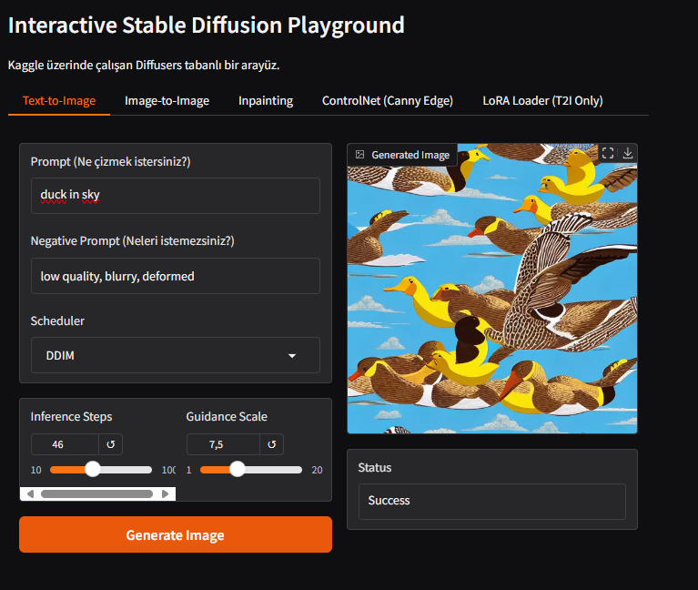
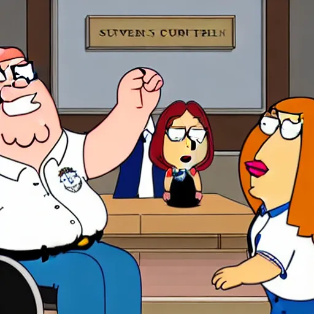
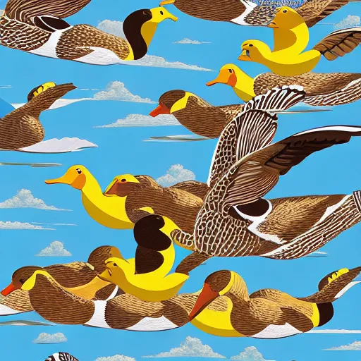

# Interactive Stable Diffusion Playground (Gradio)

## Project Description

This project is a [Gradio](https://www.gradio.app/) application that allows experimenting with various capabilities of Stable Diffusion (Text-to-Image, Image-to-Image, Inpainting, ControlNet, LoRA loading, etc.) through a user-friendly web interface. It allows users to easily generate images by playing with different parameters and combining various techniques. The application was developed in [Kaggle](https://www.kaggle.com/) Notebooks.

## Features

* **Text-to-Image:** Create images based on typed text prompts.
* Image-to-Image:** Generate new variations using a starting image and a text prompt (change strength adjustable).
* Inpainting:** Mask certain areas of the image and redraw only those areas according to the text prompt.
* ControlNet Integration:** Use additional conditions to control the structure of the image to be generated (e.g. edges with Canny Edge).
* Custom LoRA Model Loading:** Ability to load and use trained LoRA models (for example, for a specific style or concept) in `.safetensors` format.
* Selection of Schedulers:** Possibility to change the production process and results by selecting different diffusion timers (DDIM, Euler A, DPM++ 2M Karras, etc.).
* Parameter Control:** Control over many parameters such as Inference Steps, Guidance Scale, negative prompt, etc.
* **Tabbed Interface:** Organized and easy-to-use tabs for different functions.

## Technology Stack

* Python 3.x
* Gradio (for Web interface)
* PyTorch
* Hugging Face Diffusers (for Stable Diffusion pipelines)
* Hugging Face Transformers (for text processing)
* Accelerate (for optimization and distributed work)
* OpenCV-Python (for ControlNet preprocessing)
* SciPy
* Stable Diffusion v1. 5 (as default master model)

## Using the App

1. **Access the Interface:** Open the local or Hugging Face Spaces URL.
2. **Explore Tabs:** Navigate between tabs such as "Text-to-Image", "Image-to-Image", "Inpainting", "ControlNet", "LoRA Loader".
3. **Provide Input:**
 * Enter your text prompts (Prompt) and negative prompts (Negative Prompt).
    * Load your initial images where necessary (Image-to-Image, Inpainting, ControlNet).
    * Draw a mask on the image for Inpainting.
4. **Set Parameters:** Adjust the settings using the sliders (Steps, Guidance, Strength, etc.) and dropdown menus (Scheduler).
5. **Load LoRA:** (Optional) Upload your custom LoRA model by entering the path to your `.safetensors` file or the Hugging Face Hub ID using the "LoRA Loader" tab.
6. **Generate:** Click on the "Generate" button in the corresponding tab.
7. **View Results:** The generated image(s) will be shown in the interface.

**Custom LoRA Usage (Example: Family Guy LoRA):**

1. Add the Family Guy `.safetensors` [dataset](https://www.kaggle.com/datasets/oulcanakca/lora-tensors/data) from the "LoRA Loader" tab.
2. Go to the "Text-to-Image" tab.
3. Add to your Prompt the trigger word you used when training LoRA (e.g. `familyguy style`).
4. Example Prompt: `familyguy style, a lawyer arguing in court`
5. Generate the image.

## Gradio Interface

## Output Examples

*Prompt:* familyguy style, a lawyer arguing in court

*Prompt:* Duck in skye

## Possible Problems and Solutions

* **Out of Memory Error (OOM):** This can happen especially in the Hugging Face Spaces free tier or on low GPUs. Try lowering the resolution, reducing the batch size (if available) or upgrading to more powerful hardware.
**Failure to Load LoRA:** Make sure the LoRA file path or Hub ID is correct. Make sure it is in `.safetensors` format.
* Unexpected Results:** Try changing your prompt, negative prompt, steps, guidance scale or scheduler.
